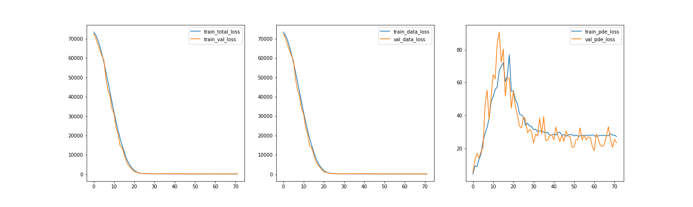
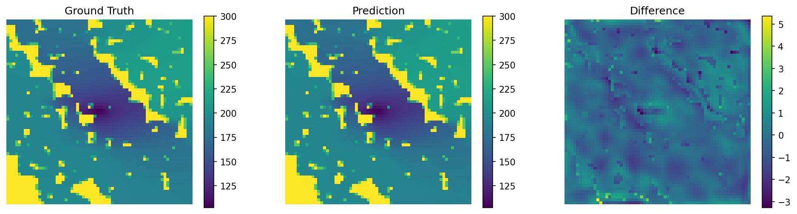
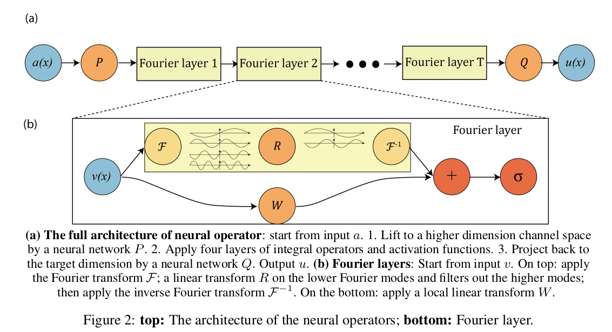
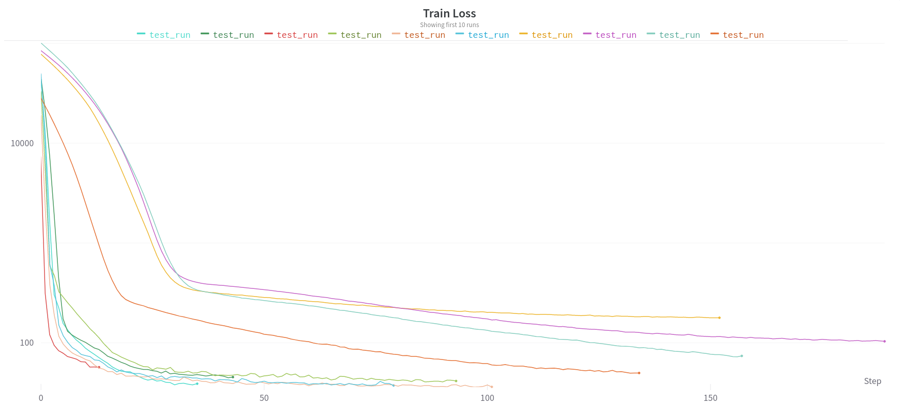
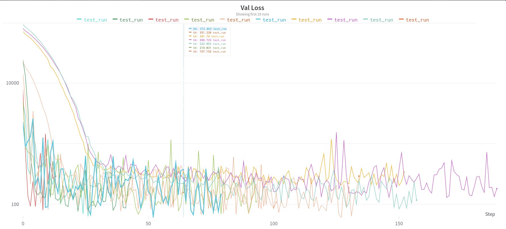
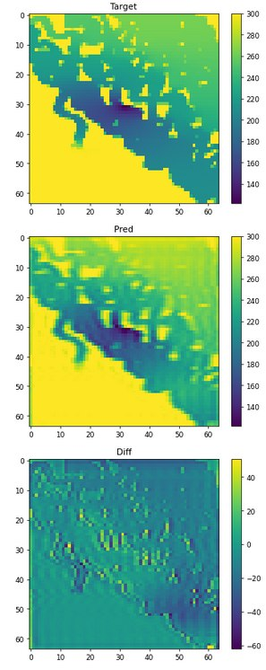

# Physics-informed well surrogate model

## Abstract
The process of calculating the pressure distribution in the reservoir is a quite time-consuming and resource-intensive task in petroleum industry. To solve this problem, we applied Unet based physics-informed neural network (PINN) which uses the pressure diffusivity equation to predict pressure maps at certain period of time after starting production for three different cases. Overall, this approach showed adequate results. Different approach for numerical solution acceleration is using neural operators like FNO or SNO for solving PDE equations instead numerical scheme. 

## Dataset generation
**Unsteady-state problem**

Commercial reservoir modelling software tNavigator in conjunction with open-source library Deepfield were used to generate data for observational component of physics-informed loss in case of the unsteady-state problem. In the center of each model, a production well was placed which operated at a constant bottomhole pressure equals to 50 bar during all the simulation time of 20 months. All hydrodynamic models had the same characteristics shown in Table 1 except the permeability maps which were taken from well-known Brugge dataset. In total 1317 simulation containing 20 time steps were performed.

Table 2. Main parameters of tNavigator models
| Main tNavigator model characteristics  |   Values  |
|----------------------------------------|-----------|
| NUMBER OF CELLS, XY                    |   64x64   |
| RESERVOIR DIMENSIONS, M                | 2800x6400 |
| INITIAL PORE PRESSURE, BARS            |    300    |
| BOTTOMHOLE PRESSURE, BARS              |    50     |
| PERMEABILITY, MD                       |   0-2900  |
| POROSITY, %                            |   20.7    |
| SIMULATION TIME, MONTHS                |    20     |
|NUMBER OF TIME STEPS                    |    20     |

**Steady-state problem**

Since the capabilities of commercial reservoir simulator tNavigator do not allow us to generate pressure fields for the steady-state case, we implemented a numerical solver of the original equation using Finite differences + Sparse Matrix Inversion method (attempts were also made to implement the solver using the Jacobi method and the tridiagonal matrix algorithm, but they showed worse results).
Since in the mathematical formulation of the sink/sourse problem q(x) is specified using a delta function $(q(x) = Q\delta(x))$, this is not suitable for numerical simulation. Therefore, we used approximation through a Gaussian potential:
$$q(\mathbf{x}) = Q\times \frac{1}{\alpha} e^{-\frac{\mathbf{x}^2}{\alpha ^2}}$$
With parameters $Q = -200/86400$, $\alpha = 100$

## PINN Unet approach

In this work we tried to create a model that can predict the pressure field by knowing the permeability field. We considered two different cases: steady-state problem and nonsteady-state one. Both of the problems were taught by using Unet model without the softmax activation function in the last layer to make it suitable for image regression problem. As the loss function we used Physics Informed loss containing data loss and PDE loss components. The huge difference in the two losses is that for PDE loss does not need to know how the actual pressure maps look like, it checks how physically true the map that we have is. After we started to train our models we saw, that PDE loss does not perform so well as data loss. Additionally, it was observed that choosing multiplier before PDE loss is crucial because it can easily make the loss component negligible. Though we still got beautiful results having only data loss and now we are able to predict pressure maps if we are given the permeability one. There is still a great space for research since our PI loss does not perform perfectly, so we will continue working on the project to create really qualitative model for pressure map predictions.

For this problem we solve the equation:

$$ S\frac{\partial h(\mathbf{x}, t)}{\partial t} - \nabla [K(\mathbf{x})\nabla h(\mathbf{x}, t)] - q(\mathbf{x}) = 0 $$

With boundary conditions:

$$  h(\mathbf{x}, t) = \partial h \in \partial \Omega $$

$$ K(\mathbf{x})\nabla h(\mathbf{x}, t)\cdot \mathbf{n} = g(\mathbf{x}) \in \partial \Omega $$

And initial condition:

$$ h(\mathbf{x}, t=0) = h_0 $$

To solve this problem, the same functions were used as those obtained for the steady-state problem. The exception is that $\mathcal{L}^{\text{PDE}}$, now includes a term containing the partial time derivative, and the loss values are averaged over the number of time layers $T$.

Thus,

$$ \mathcal{L}^{\text{PDE}}(\theta) = \frac{1}{N\times T} \sum\limits_{i=0}^N \sum\limits_{t=0}^T \Vert \nabla [K(\mathbf{x_i})\nabla h(\mathbf{x_i}, t)] - q(\mathbf{x_i}) - 0\Vert_2^2 $$

$$ \mathcal{L}^{\text{D}}(\theta) = \frac{1}{N\times T} \sum\limits_{i=0}^N\sum\limits_{t=0}^T \Vert h(\mathbf{x_i}, t) - \partial h\Vert_2^2 $$

$$ \mathcal{L}^{\text{NB}}(\theta) = \frac{1}{N\times T} \sum\limits_{i=0}^N\sum\limits_{t=0}^T \Vert K(\mathbf{x_i})\nabla h(\mathbf{x_i}, t) - g(\mathbf{x_i})\Vert_2^2 $$

Similar to the previous point, all the loss functions are implemented using basic PyTorch functions and allow to change all system parameters.

For differents losses loss curve view as:

In contrast to the previous works, point-sink in the middle of the geological formation has been used to induce pressure change being, in essence, production well analogue. As a result, we obtained a single well model in the permeability field, the pressure at each time step of which is calculated with a small error. For example, on one of the test examples, we can see that the RMSE error is about **6 bar** (about 3% of the average value on the pressure map. For an oil dataset (20 years, the whole tank is oil) we got an RMSE metric of **16 bar**, which is an excellent result. If you use PDE loss together with data loss, it increases the training time of the model. The RMSE metric for data loss and PDE loss we got a metric of **59 bar** with less training time.

## FNO problem

We try to use FNO architecture for solving similar problem

Table 1. Different input and output data for FNO2D.
| Input data     | Output data      | RMSE, bar |
|----------------|------------------|-----------|
| $p(t=1)$       | $p(t=2,3,4)$     | 3.45      |
| $p(t=1)$       | $p(t=2,...,20)$  | 20.19     |
| $p(t=1)$       | $p(t=7,14,20)$   | 15.71     |
| $k,p(t=1)$     | $p(t=7,14,20)$   | 15.17     |
| $p(t=1,...10)$ | $p(t=10,...,20)$ | 1.31      |

The quality and numeric results you can see on figure below:

## Custom FNO problem

The Custom Fourier Neural Operator was also implemented in this work. Working with it showed that the learning speed and accuracy depend significantly, first of all, on the number of modes to be clipped (expectedly) and the geometry of the model. So, increasing number of blocks, adding additional Fourier layers practically does not affect model performance, however situation changes sharply if model width is increased. Thus, in our work, the best results (RMSE ~ 6 bar) were achieved using four convolutional blocks and two Fourier layers with a lifting from 64 to 256.

Architecture:

However, the custom implementation still shows slightly worse results compared to the "out of the box" model. Thus, in all experiments we observe a slight blurring of the resulting pressure fields. This problem can be circumvented by increasing the number of convolution blocks and the width of the model.

And yet, despite this, a custom realization (in a better architecture) allows to reach an acceptable error level after just a few epochs, i.e. several times faster than the out-of-the-box model.

## SNO problem
Spectral neural operator (SNO) is deep learning architecture designed to approximate of mappings between Banach spaces. In contrast to Fourier neural operator, SNO could use the other spectral basis e.g graph Laplacian eigenfunctions, Chebyshev basis. The functionality is based on well-developed fast, and stable algorithms from spectral methods. We used the code from the article "Spectral Neural Operators" by V. Fanaskov and I. Oseledets as a baseline in our implementation of the method.

Particularly, an attempt to implement SNO in Cheishev basis has been made using primarily jax framework.

